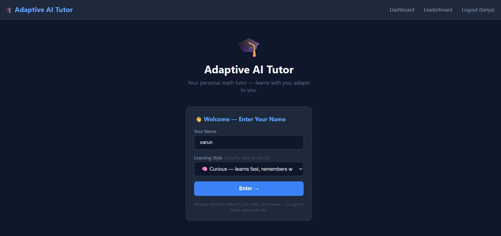
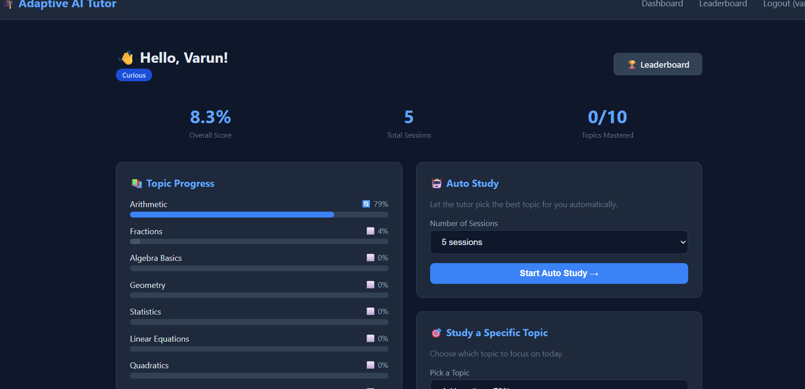
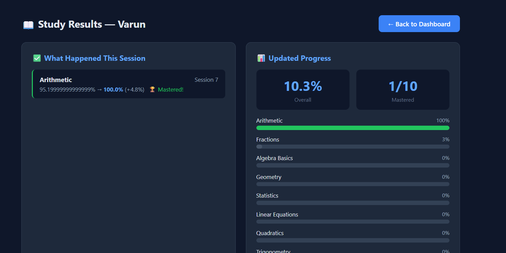
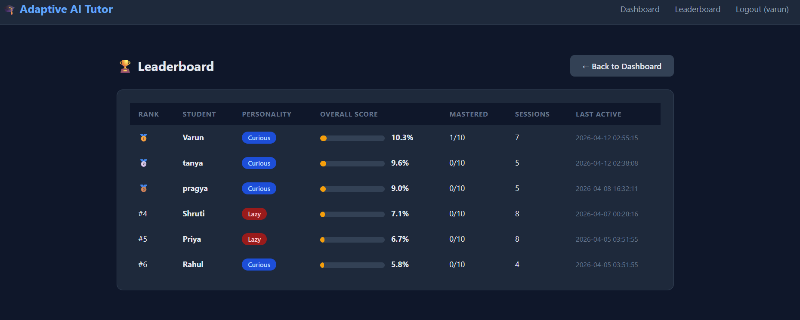

# 🎓 Adaptive AI Tutor

A personal AI tutor that teaches you math step by step — remembers your progress, adapts to how you learn, and never gets tired.

---

## 🖼️ Screenshots

### Login Page


### Dashboard


### Study Results


### Leaderboard


---

## 📁 Project Structure

```
adaptive-ai-tutor/
├── tutor.py          ← brain of the project (do not edit)
├── main.py           ← run this in terminal to study
├── app.py            ← run this to open the web app
├── analysis.py       ← compare all students in tables
├── charts.py         ← visual progress charts
├── requirements.txt  ← libraries needed
├── README.md         ← you are here
├── 📁 templates/     ← web app pages
│     ├── base.html
│     ├── index.html
│     ├── dashboard.html
│     ├── study_result.html
│     └── leaderboard.html
├── 📁 screenshots/   ← project screenshots
└── 📁 student_data/  ← auto-created, stores student progress
```

---

## 🚀 How to Run — Web App (Recommended)

**Step 1** — Open your project folder → click address bar → type `powershell` → Enter

**Step 2** — Install Flask (one time only):
```bash
py -m pip install flask
```

**Step 3** — Start the web app:
```bash
py app.py
```

**Step 4** — Open your browser and go to:
```
http://localhost:5000
```

---

## 💻 How to Run — Terminal Version

```bash
py main.py        → study as a student
py analysis.py    → see student comparison tables
py charts.py      → see visual progress charts
```

---

## 👤 How Students Register

No signup needed. Just:
1. Open `http://localhost:5000`
2. Type your name
3. Pick your learning style
4. Click **Enter**

Returning students just type their name — progress loads automatically.

---

## 📋 The Web App Pages

| Page | What it does |
|---|---|
| Login | Enter name and learning style |
| Dashboard | See progress, study topics, view scores |
| Study Results | See what you learned each session |
| Leaderboard | Compare all students ranked by score |

---

## 📚 Topics & Learning Order

| # | Topic | Needs First |
|---|---|---|
| 1 | Arithmetic | Nothing — start here |
| 2 | Fractions | Arithmetic |
| 3 | Algebra Basics | Arithmetic + Fractions |
| 4 | Geometry | Arithmetic |
| 5 | Statistics | Arithmetic + Fractions |
| 6 | Linear Equations | Algebra Basics |
| 7 | Quadratics | Linear Equations |
| 8 | Trigonometry | Geometry + Algebra Basics |
| 9 | Probability | Statistics + Fractions |
| 10 | Calculus Intro | Quadratics + Trigonometry |

---

## 🎭 Student Personalities

| | Curious | Lazy | Anxious |
|---|---|---|---|
| Learns | Fast | Slow | Medium |
| Forgets | Slowly | Quickly | Medium |
| Weakness | None | Needs repetition | Panics without prerequisites |

---

## 💾 How Saving Works

- Progress saves automatically after every session
- Each student gets their own file in `student_data/`
- Same name = loads your progress. New name = fresh start
- Delete your `.json` file to start over

---

## ❓ Quick FAQ

**Need to install anything?**
```bash
py -m pip install flask pandas matplotlib
```

**How to add a new student?**
Open the website and enter a new name — done automatically.

**Forgot your name?**
Check the leaderboard page — all students are listed there.

**Want to start fresh?**
Delete your file from the `student_data` folder.

---

## 🛠️ Requirements

```
Python 3.11+
flask>=2.0.0       (for web app)
pandas>=2.0.0      (for analysis.py)
matplotlib>=3.7.0  (for charts.py)
```

Install everything:
```bash
py -m pip install flask pandas matplotlib
```

---

## 📦 Coming Soon

Claude AI explanations · Online deployment · Password login

---

